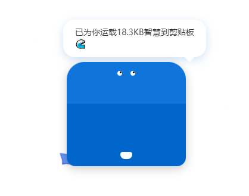

# 智能鲸灵助手 (DeepWhale Assistant)

    
🐋 为DeepSeek打造的智能交互油猴脚本，通过可爱的像素风格鲸鱼形象增强用户体验

    

        
        
        
    

## ✨ 特色功能

### 🎯 智能交互

    
    
<i>智能鲸灵助手的默认外观</i>

- 🐋 可爱的蓝色鲸鱼形象，带有灵动的尾巴动画
- 🎮 丰富的互动效果：
  - 单击：显示问候 `"你好啊！有我登场你就放心吧 ^_^"`
  - 双击：跳跃并说 `"好开心！让我帮你解答问题吧！"`
  - 三击：旋转并说 `"哇！你太热情啦！我都要转晕了～"`
- 💬 智能对话气泡，增强用户体验

    
    
<i>点击时的动画效果和问候语</i>

### 🎨 界面定制与反馈

    
    
<i>支持拖拽移动、大小调整，复制时会显示贴心提示</i>

- 🖱️ 支持拖拽移动位置
- 📏 可调整鲸鱼大小
- 💾 自动保存位置和大小设置
- 🌙 深夜模式（0-6点自动切换）
- 📋 复制时显示提示：`"已为你运载18.3KB智慧到剪贴板"`

## 🚀 快速开始

### 安装步骤
1. 安装 [Tampermonkey](https://www.tampermonkey.net/) 浏览器插件
2. 下载 `deepwhale.user.js` 文件到本地
3. 打开 Tampermonkey 的管理面板（点击浏览器扩展图标、添加脚本）
4. 将下载好的 `deepwhale.user.js` 文件拖入此编辑器区域
5. 在弹出的安装页面中点击"安装"按钮
6. 打开或刷新 DeepSeek 页面，即可在右下角看到小鲸鱼

### 使用说明

    
    
<i>拖拽区域和缩放手柄示意图</i>

1. **基础操作**
   - 拖拽：按住鲸鱼头部移动
   - 缩放：拖动右下角手柄调整大小
   - 点击：触发不同的互动效果

## 💡 技术实现

### 核心特性
- 🎨 使用CSS绘制的鲸鱼形象
- 🎭 CSS动画实现互动效果
- 💾 使用GM_setValue保存设置
- 🔒 仅在DeepSeek域名下运行

### 兼容性
- ⚡ 支持主流浏览器
- 🔄 支持DeepSeek官方域名
- 💻 支持本地开发环境

## 🤝 贡献指南

欢迎提交 Issue 和 Pull Request！

1. Fork 本仓库
2. 创建特性分支：`git checkout -b feature/AmazingFeature`
3. 提交改动：`git commit -m 'Add some AmazingFeature'`
4. 推送分支：`git push origin feature/AmazingFeature`
5. 提交 Pull Request

## 📝 开源协议

本项目基于 MIT 协议开源，详见 [LICENSE](./LICENSE) 文件。

## 🙏 致谢

- 感谢 [DeepSeek](https://deepseek.com) 提供的平台支持
- 感谢所有贡献者的付出

---

    
🐋 让我们一起让AI交互变得更有趣！

